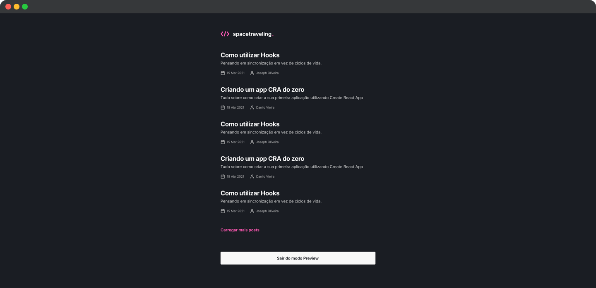

<h1 align="center">
  
</h1>

<p align="center">
  

  
</p>

<br>

<p align="center">
  
</p>

<br>

## 🧪 Tecnologias

Esse projeto foi desenvolvido com as seguintes tecnologias:

- [React](https://reactjs.org)
- [NextJS](https://nextjs.org/)
- [Sass](https://sass-lang.com/)
- [Prismic CMS](https://prismic.io/)
- [Utterances](https://utteranc.es/)
- [TypeScript](https://www.typescriptlang.org/)

## 💻 Projeto

spacetraveling foi desenvolvido com o objetivo de colocar em prática os conceitos de Static Site Generation (SSG) e utilizar Prismic CMS para adição e gerenciamento do conteúdo e listagem de posts de um blog.

Como desafio complementar foi adicionado sessão de comentários utilizando Utterances, acesso a Preview dos posts do Prismic CMS, controle de navegação dentro do post para ir para o próximo ou anterior e adição de tag com data de quando o post sofreu a ultima edição.

Este é um projeto desenvolvido como prática das aulas do Chapter III da trilha ReactJS do **[Programa Ignite](https://www.rocketseat.com.br/ignite)** da Rocketseat.

## 🚀 Como executar

Clone o projeto e acesse a pasta do mesmo.

```bash
$ git clone https://github.com/rafaelramosdev/spacetraveling-features
$ cd spacetraveling-features
```

Para iniciá-lo, siga os passos abaixo:

```bash
# Instala as dependências
$ yarn

# Na raiz do projeto, no arquivo .env.local
# Preencha as variáveis ambiente de acordo com as instruções
$ .env.local

# Inicia o website
$ yarn dev
```

O website estará disponível no seu navegador pelo endereço [`http://localhost:3000`](http://localhost:3000).

## 📄 Licença

Esse projeto está sob a licença MIT. Veja o arquivo [LICENSE](LICENSE) para mais detalhes.

---

Feito by [Rafael Ramos](https://rafaelramos.dev/) 🙋🏻‍♂️
